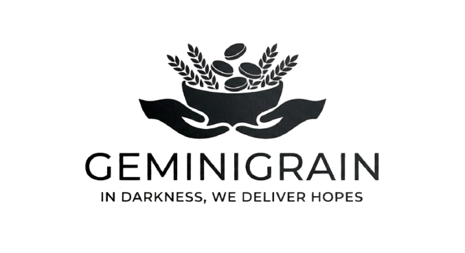

<div align="center">

<br/>



# GeminiGrain

### *Every Meal Saved Matters*

**AI-powered food rescue platform — connecting surplus food to those who need it, in real time.**

<br/>

[](https://resqfood-delta.vercel.app)
[](https://hackdays.in)
[](https://ai.google.dev)
[](https://nextjs.org)

</div>

---

## The Problem

India wastes **68 million tonnes** of food every year while **194 million people** go hungry.  
The gap between a wedding buffet and a labour colony 3 km away is not distance — it's **zero coordination**.

Current tools are broken: WhatsApp groups, manual calls, zero food safety checks, no urgency intelligence.

---

## The Solution

GeminiGrain is a **full-stack, AI-native food rescue platform** with three portals — Donor, NGO, and Volunteer — built around one insight:

> **The bottleneck is intelligence, not intention.**  
> Gemini provides that intelligence at every step.

```
Donor types (in Hindi):  "mere paas 40 plate biryani hai jaldi uthwa lo"
                                        ↓
              Gemini NLP → Food: Biryani | Qty: 40 | Urgency: HIGH | Window: 4h
                                        ↓
              Gemini Vision → Scans food photo → Result: GOOD ✅ (91% confidence)
                                        ↓
              Gemini Ranks NGOs → #1 Roti Bank 2.3km (94%) · #2 Sewa Samiti 4.8km (78%)
                                        ↓
              NGO accepts → Volunteer dispatched → Food delivered to Kasna Labour Colony
```

**No forms. No phone calls. One Hindi sentence → complete rescue operation.**

---

## Gemini AI — The Core of Everything

> Remove Gemini, and the platform cannot accept a single donation.

| Integration | File | What it does |
|---|---|---|
| **Natural Language Understanding** | `app/api/gemini/analyze/route.ts` | Converts raw Hindi/English donor messages into structured JSON — food name, quantity, urgency, dietary type, spoilage window |
| **Computer Vision Food Safety Gate** | `app/api/gemini/analyze-image/route.ts` | Inspects uploaded food photos for freshness, contamination, storage. `REJECT` hard-blocks the submission at the API layer |
| **Multi-Factor NGO Ranking** | `app/api/gemini/ngo-rank/route.ts` | Scores NGOs on dietary match, distance, volunteer availability, capacity, acceptance rate — simultaneously |
| **AI Decision Engine** | `app/api/gemini/decision/route.ts` | Fires when primary NGO is unresponsive. Reassigns, escalates urgency, or re-ranks volunteers automatically |

---

## Features

- 🌐 **Multilingual input** — Hindi, English, Hinglish; no form filling required
- 📸 **Vision food safety gate** — AI blocks unsafe food before it enters the system  
- 🗺️ **Live map** — donor pins, NGO locations, volunteer routes, 5 high-need zones
- 👤 **3-role auth system** — Donor / NGO / Volunteer with OTP login + demo access
- 📜 **AI-generated Food Safety Certificates** — Gemini creates chain-of-custody proof on delivery
- 🚨 **Urgency escalation** — AI auto-reassigns when NGO timeout exceeds spoilage window
- 🏅 **Volunteer gamification** — badges, impact tracking, leaderboard

---

## Tech Stack

| Layer | Technology |
|---|---|
| Framework | Next.js 16.2 (App Router, TypeScript) |
| Styling | Tailwind CSS + Framer Motion |
| AI | Google Gemini 2.5 Flash (text + multimodal) |
| Maps | Leaflet + React-Leaflet + OSRM routing |
| Auth | Custom OTP-based sessions (in-memory, zero DB) |
| Deployment | Vercel |

---

## Quick Start

```bash
git clone https://github.com/Aayush9808/GeminiGrain.git
cd GeminiGrain
npm install
```

```bash
# .env.local
GEMINI_API_KEY=your_key_here   # aistudio.google.com/app/apikey
```

```bash
npm run dev   # → http://localhost:3000
```

**No database required.** All data is in-memory — works instantly out of the box.

> **One-click demo login** available on the live site — no signup needed.  
> Try Donor → NGO → Volunteer flow in 2 minutes.

---

## Project Structure

```
GeminiGrain/
├── app/
│   ├── api/               # Backend API routes
│   │   ├── gemini/        # 4 Gemini AI endpoints
│   │   ├── auth/          # OTP auth + demo login
│   │   ├── donations/     # Donation CRUD + flow
│   │   └── ...
│   ├── donor/             # Donor dashboard
│   ├── ngo/               # NGO dashboard
│   ├── volunteer/         # Volunteer dashboard
│   └── page.tsx           # Landing page
├── components/            # Shared UI components
├── lib/                   # Types, store, services
└── public/                # Assets
```

---

## Team

**Aayush Kumar Shrivastava** · **Sanskar Yadav**  
Galgotias College of Engineering & Technology, Greater Noida

HackDays 2026 · GCET × HackBase × MLH  
Track: **Best Use of Google Gemini API Keys**

---

<div align="center">

[🌐 Live Demo](https://resqfood-delta.vercel.app) · [📋 Pitch Deck](PITCH.md)

</div>
